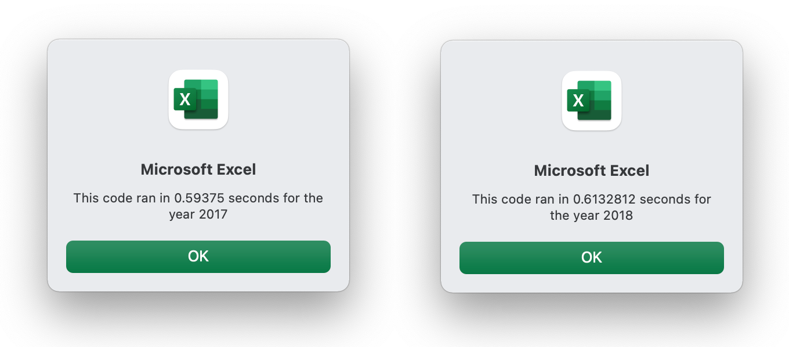

# Stock Data Analysis (Module 2 Challenge)

## Overview of Project
Steve wants to analyze which stocks will be best for his parents, to ensure that they're making the right financial decisions. He wants to have code written in way that will most effectively help his endeavors, and have the code analyzed for effectiveness.
### Purpose
The purpose of this analysis is two-fold:
* To help Steve determine how stocks performed in 2017 and 2018
* To help him find faster and more effective ways to get this information, by refactoring the original code that was writeen. The original code worked well for a dozen stocks, but Steve needs assurance that the code that's used will effectievely work for thousands of stocks. He needs help to see if refactoring the code will improve execution times.

## Results
### Stock Performance in 2017 and 2018
After analyzing starting and ending prices for stocks for 2017 and 2018, it is very clear that most stocks performed more poorly in 2018 than in 2017, with all except two having negative returns, including the DQ stock that Steve's parents had an interest in. The two stocks that performed better in 2018 were:
* The RUN stock, which had a significant improvement in returns from 5.5% in 2017 to 84.0% in 2018
* The TERP stock, which had a slight improvement in returns, from -7.2% in 2017 to -5.0% in 2018, although it still had a negative return

For more details on all of the stock returns, see *Chart 1: Stock Returns 2017 and 2018* (below).

##### *Chart 1: Stock Returns 2017 and 2018*


### Execution Times of Original Script and Refactored Script
In terms of differences in execution times of the original script compared to the refactored code, the refactored code improved peformance quite drastically. For both the 2017 and 2018 stock data sets, the refactored script was executed 5.4 times faster than the original script. See the popups in *Charts 2 and 3* (below).

##### *Chart 2: Original Code*

##### *Chart 3: Refactored Code*


## Summary
### Advantages or Disadvantages of Refactoring Code
Advantages of refactoring code include:
* The code is better quality and is more efficient.
* The code becomes more flexible and thus the capability of the code increases.
* The improved code logic makes is easier for future developers to read, understand and maintain.

Some disadvantages of refactoring code include:
* It can be time consuming, which could cost a company or organization developers' time or focus better spent on other high priorities. It could be hard to predict how much time a refactoring effort may take.

* It could result in a situation where a better solution ultimately isn't created, or the solution may not provide enough value for the effort to have been worth it.

### Pros and Cons Related to Refactoring the Original VBA Script
The advantage of the original VBA Script is that it was simple and fairly easy to understand, and easy to execute on a smaller set of data. A disadvantage is that it wasn't as effective with larger datasets, and its execution time was slower. The advantage of the refactored code is that it created a 5.4-fold decrease in execution times, which will be more effective on large sets of data. Unlike the original code, the refactored code introduced the *tickerIndex* variable, which allowed for all of the data rows to be looped through all at once. See *Code Example 1* (below). A disadvantage of the refactored code is that it did take some time to troubleshoot and discover an improved solution, and the level of decrease in execution times may not have been enough to be worth the time spent.
##### *Code Example 1: Refactored Code*
```
'2b) Loop over all the rows in the spreadsheet.
    For i = 2 To RowCount
        
        '3a) Increase volume for current ticker
        tickerVolumes(tickerIndex) = tickerVolumes(tickerIndex) + Cells(i, 8).Value
        
        '3b) Check if the current row is the first row with the selected tickerIndex.
        'If  Then
        If Cells(i, 1).Value = tickers(tickerIndex) And Cells(i - 1, 1).Value <> tickers(tickerIndex) Then
        
                tickerStartingPrices(tickerIndex) = Cells(i, 6).Value
        'End If
        End If
        '3c) check if the current row is the last row with the selected ticker
         'If the next row’s ticker doesn’t match, increase the tickerIndex.
        'If  Then
        If Cells(i, 1).Value = tickers(tickerIndex) And Cells(i + 1, 1).Value <> tickers    (tickerIndex) Then
        
            tickerEndingPrices(tickerIndex) = Cells(i, 6).Value
            
            '3d Increase the tickerIndex.
            tickerIndex = tickerIndex + 1
        'End If
        End If
```
